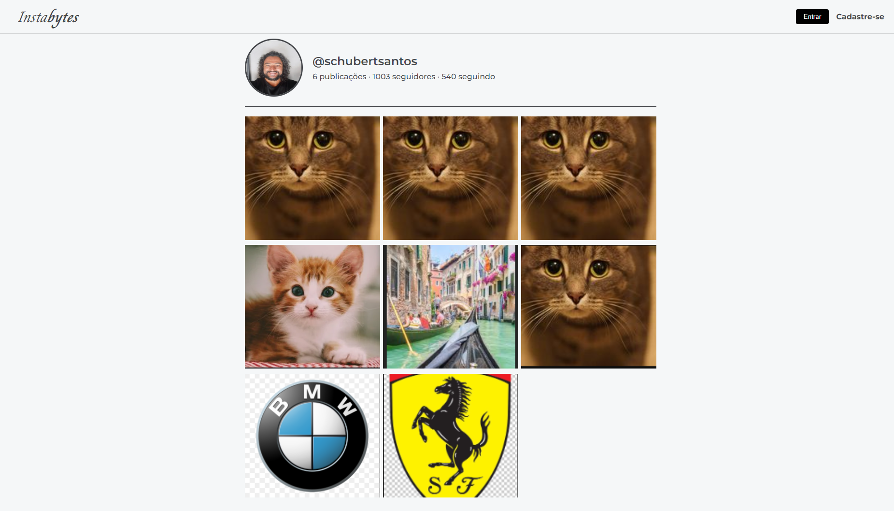

<h1 align="center"> Imersão Back-End </h1>

Programa exclusivo e gratuito, promovido pela Alura para ensino de tecnologias Front e Back End.  

  <a href="#-tecnologias">Tecnologias</a>&nbsp;&nbsp;&nbsp;|&nbsp;&nbsp;&nbsp;
  <a href="#-projeto">Projeto</a>&nbsp;&nbsp;&nbsp;|&nbsp;&nbsp;&nbsp;
  <a href="#-layout">Layout</a>&nbsp;&nbsp;&nbsp;|&nbsp;&nbsp;&nbsp;
  <a href="#memo-licença">Licença</a>

 

  

## 🚀 Tecnologias

Esse projeto foi desenvolvido com as seguintes tecnologias:

- Node.js
- JavaScript
- MongoDB
- Google Gemini
- thunderClient 
- Postman
- Git e Github

## 💻 Projeto

O InstaBytes é uma Rede Social para usar como Blog de Fotos online.

- [Acesse o projeto finalizado, online](https://schubertsantos.github.io/imersao-backEnd-Gemini)

## 🔖 O que foi aprendido nesse Projeto de Estudos

- Conhecer o projeto de blog de fotos;
- Instalar o Node.js;
- Aprender o que é um servidor;
- Criar e subir um servidor;
- Criar a sua API Key do Gemini.
- Criar uma base de dados;
- Criar um mock com ajuda do Gemini;
- Armazenar os seus dados;
- Adicionar rotas;
- Utilizar o bancos de dados MongoDB;
- Preparar o MongoDB para subir o recurso na Nuvem.
- Configurar o primeiro Cluster, Database e coleção no MongoDB;
- Criar variáveis de ambiente;
- Conectar o Banco com a API via String de conexão;
- Criar código de configuração do banco na API;
- Refatoração do primeiro get.
- Enviar informações para a sua base de dados;
- Aprender sobre verbos HTTP;
- Criar a rota POST/post e POST/upload;
- Implementar o upload de imagens;
- Testar a API com thunderClient e Postman.
- Fazer a lógica de armazenamento de imagens no servidor;
- Criar a rota PUT para atualização de post;
- Integrar com o Frontend;
- Integrar com a API do Gemini;
- Fazer o deploy do back-end na Google Cloud.

---

